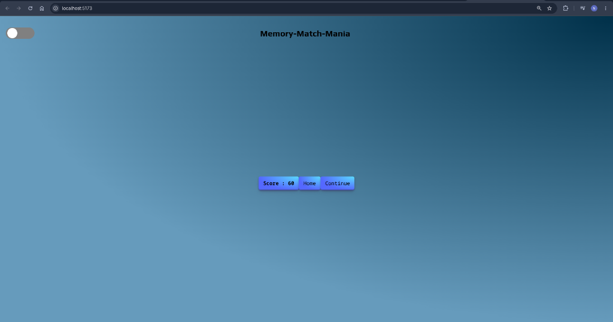
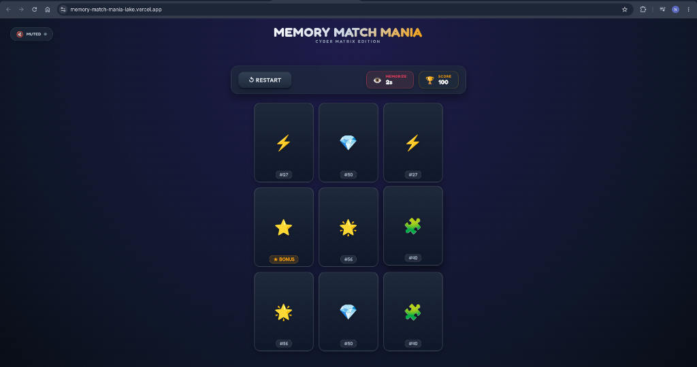
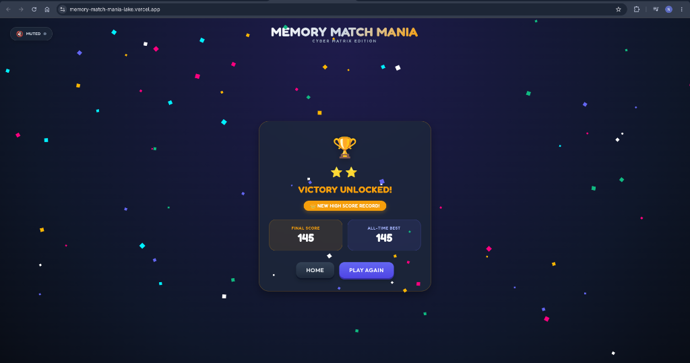

# 🎮 Memory Match Mania — Cyber Matrix Edition (v2.0.0)

**Memory Match Mania** is a feature-rich, interactive web-based memory card game built with **React**, **Redux Toolkit**, and **Vite**. Test your memory speed and precision across multiple grid modes, enjoy responsive cyber-arcade visuals, sound effects, and track your high scores.

🌐 **Live Demo**: [https://memory-match-mania-lake.vercel.app/](https://memory-match-mania-lake.vercel.app/)

---

## 🖼️ Visual Evolution: v1.0.0 vs v2.0.0

| 🔴 Version 1.0.0 (Legacy UI) | 🟢 Version 2.0.0 (Cyber Matrix Gameplay) |
| :---: | :---: |
|  |  |
| *Basic plain background & browser defaults* | *3D flip cards, Fredoka typography & cyber grid* |

### 🏆 Victory Unlocked & High Score Tracking (v2.0.0)



---

## 🚀 Before vs After Version Comparison

Below is an overview comparing **Version 1.0.0 (Initial Release)** with **Version 2.0.0 (Major Overhaul & Cyber Matrix Edition)**:

| Feature / Aspect | 🔴 Version 1.0.0 (Initial Release) | 🟢 Version 2.0.0 (Cyber Matrix Edition) |
| :--- | :--- | :--- |
| **Visual Design** | Minimal plain gradient layout with generic text | Cyber-Arcade theme, glassmorphism, Fredoka typography, and flat action buttons |
| **Grid Modes** | Static basic grid structure | Dynamic 3×3 Rookie Mode (with Wildcard Star tile) and 4×4 Pro Mode |
| **Card Mechanics** | Instant reveal without 3D rotation | 3D card flip animations with hover effects and glow state indicators |
| **Victory Feedback** | Basic textual status | Confetti particle celebration, star rating, final score & best score summary |
| **High Score Storage** | Temporary session memory | Persistent `localStorage` high score tracking |
| **Audio Integration** | Direct audio calls with console noise | Refactored `MusicWrapper` & `GameAudio` module system with mute control |
| **Build Stability** | Default Vite configuration with peer dep warnings | Optimized Vite v5.2.0 build pipeline with `.npmrc` legacy peer deps support |

---

## ✨ Key Features

- **🕹️ Multiple Difficulty Modes**:
  - **Rookie Mode (3×3 Grid)**: 9 cards featuring 4 pairs + 1 Bonus Wildcard Star tile (`⭐`).
  - **Pro Mode (4×4 Grid)**: 16 cards featuring 8 matching pairs.
- **🎨 Cyber-Arcade Interface**: Vibrant neon aesthetics, smooth 3D flip card animations, glassmorphic containers, and Fredoka typography.
- **🎉 Confetti Celebrations**: Visual particle explosions when completing a grid level.
- **🔊 Audio & Sound FX**: Interactive sound triggers for clicks, card flips, and toggleable ambient background audio.
- **🏆 High Score Tracking**: Saves your highest score locally in your browser (`localStorage`).
- **📱 Fully Responsive**: Optimized for desktop, tablet, and mobile browsers.

---

## 🛠️ Tech Stack

- **Frontend Framework**: React 18
- **State Management**: Redux Toolkit & React-Redux
- **Build Tool**: Vite 5.2.0
- **Styling**: CSS Modules, CSS Custom Properties & Google Fonts (`Fredoka`)
- **Audio Engine**: `use-sound`
- **Effects & Helpers**: Canvas Confetti & Fisher-Yates shuffle algorithm
- **Deployment**: Vercel

---

## 📂 Project Structure

```text
Memory-Match-Mania/
├── docs/
│   └── screenshots/
├── public/
├── src/
│   ├── assets/
│   ├── components/
│   │   ├── Button/
│   │   ├── Card/
│   │   ├── Confetti/
│   │   ├── Game/
│   │   ├── GameAudio/
│   │   ├── GameOptionScreen/
│   │   ├── GameOver/
│   │   ├── MusicWrapper/
│   │   ├── Score/
│   │   ├── StartScreen/
│   │   └── Timer/
│   ├── features/
│   │   └── game/
│   ├── utils/
│   ├── App.jsx
│   ├── index.css
│   └── main.jsx
├── package.json
└── vite.config.js
```

---

## 📈 Version 2.0.0 Improvements Summary

1. **Live Deployment**: Hosted live at [memory-match-mania-lake.vercel.app](https://memory-match-mania-lake.vercel.app/).
2. **Complete Visual Overhaul**: Upgraded from standard generic boilerplate styles to a Cyber-Arcade UI with custom Fredoka font and flat-style buttons.
3. **Visual Showcase Included**: Embedded screenshots highlighting the difference between v1.0.0 legacy UI and v2.0.0 victory / gameplay views.
4. **Confetti Celebration System**: Added canvas-confetti upon completing grid matching.
5. **State & Storage Enhancements**: Local storage score persistence and refined Redux state reducers.
6. **Clean Code & Audio Module Refactoring**: Modularized audio handlers, eliminated console logs, and resolved Vite build dep warnings.
